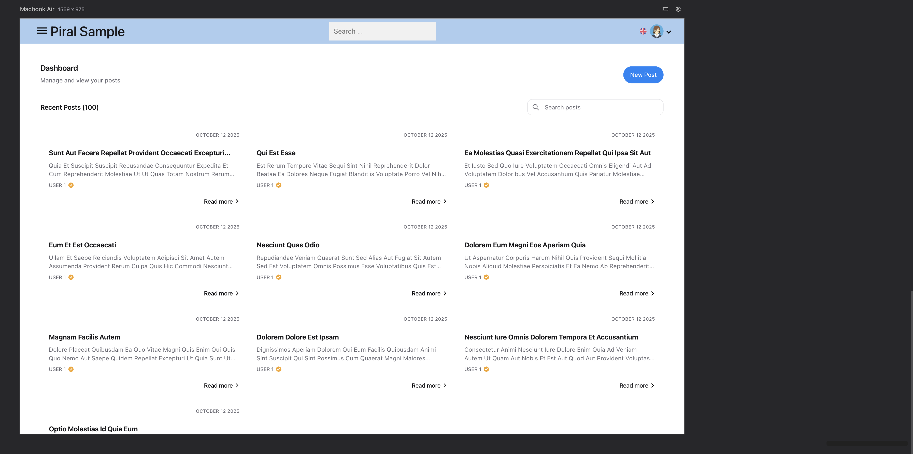
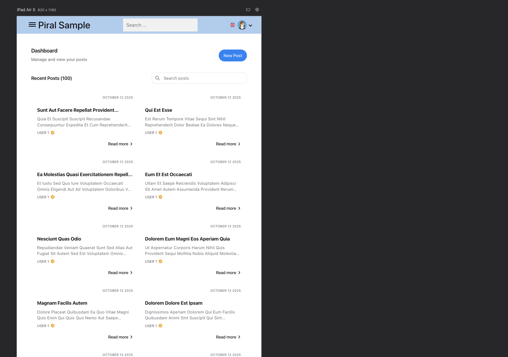
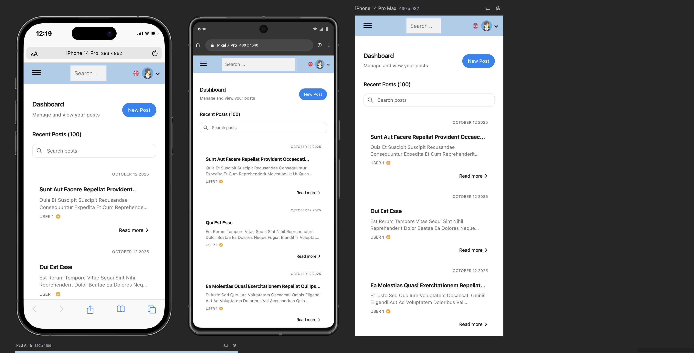
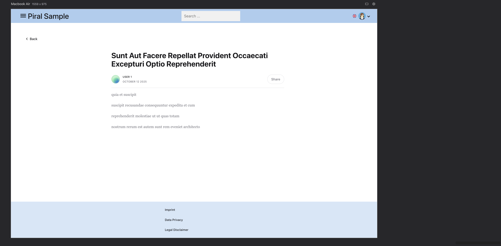
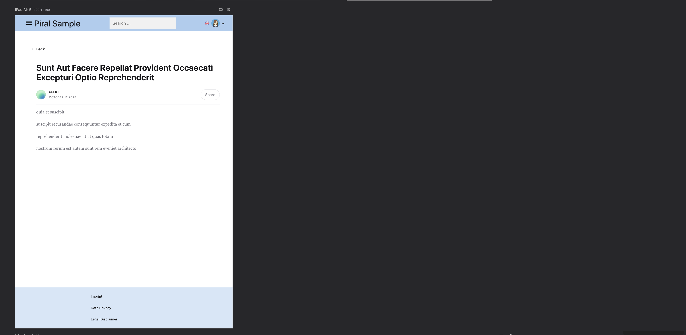
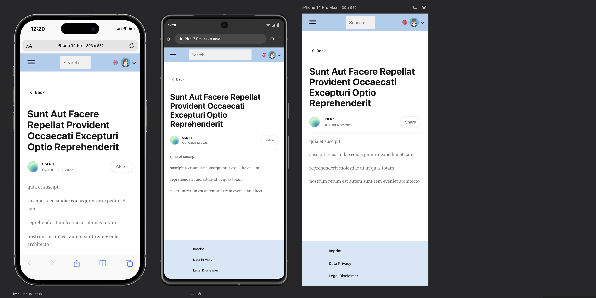
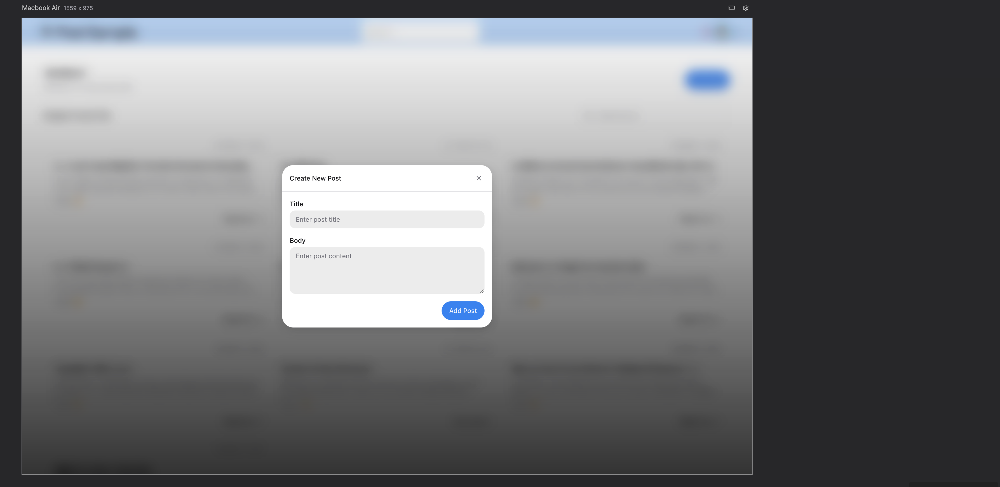
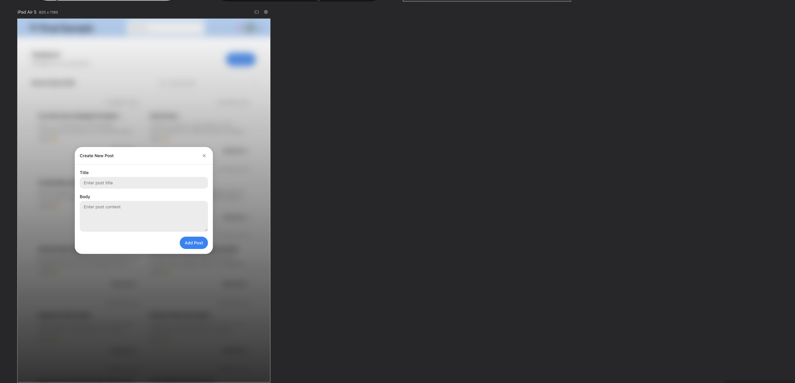
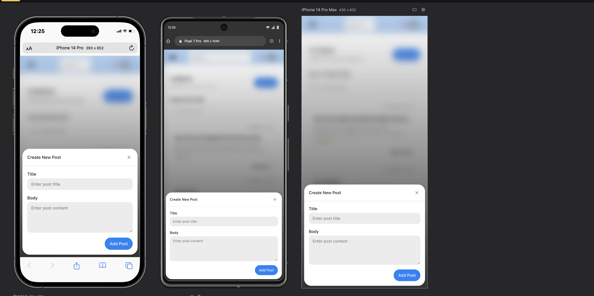

# Dashboard Pilet - Take-Home Test

A modern, production-ready Piral microfrontend module (pilet) that provides a comprehensive Dashboard page with post management functionality.

## Features

### Core Features

- **Dashboard Page** - Browse and search posts with pagination
- **Post Details** - View individual post details with user information
- **Create Posts** - Add new posts with validated forms
- **Search Functionality** - Real-time search across post titles and content
- **Pagination** - Navigate through posts 10 at a time
- **Local State Management** - Optimistic UI updates with Zustand

### Technical Highlights

- **Lazy Loading** - Code-split pages for optimal performance
- **Custom Sass Architecture** - Professional, scalable styling system
- **Form Validation** - Formik + Yup for robust validation
- **Unit Tests** - 67 tests with 100% pass rate
- **Search & Filter** - Real-time post filtering
- **Error Boundaries** - Graceful error handling
- **Accessibility** - WCAG compliant components

## Screenshots

### Dashboard - All Devices

<p align="center">
  
  <em>Dashboard - Desktop View</em>
</p>

<p align="center">
  
  <br/>
  <em>Dashboard - Tablet View</em>
</p>

<p align="center">
  
  <br/>
  <em>Dashboard - Mobile View</em>
</p>

### Post Detail - All Devices

<p align="center">
  
  <em>Post Detail - Desktop View</em>
</p>

<p align="center">
  
  <br/>
  <em>Post Detail - Tablet View</em>
</p>

<p align="center">
  
  <br/>
  <em>Post Detail - Mobile View</em>
</p>

### Create Post Modal - All Devices

<p align="center">
  
  <em>Create Post Modal - Desktop</em>
</p>

<p align="center">
  
  <br/>
  <em>Create Post Modal - Tablet</em>
</p>

<p align="center">
  
  <br/>
  <em>Create Post Modal - Mobile</em>
</p>

## Prerequisites

- Node.js (v16 or higher)
- npm (v8 or higher)

## Quick Start

### Installation

```bash
# Clone the repository
git clone <repository-url>
cd turog-frontend-test

# Install dependencies
npm install
```

### Development

```bash
# Run in development mode with Piral debug shell
npm start

# This will start the pilet in debug mode
# Navigate to http://localhost:1234 (or the configured port)
```

### Building

```bash
# Build the pilet for production
npm run build

# The output will be in the dist/ directory
```

### Testing

```bash
# Run all unit tests
npm test

# Run tests in watch mode
npm run test:watch

# Generate coverage report
npm run test:coverage
```

## Project Structure

```
src/
├── components/          # Reusable UI components
│   ├── posts/          # Post-specific components
│   │   ├── EmptyState.tsx
│   │   ├── PostCard.tsx
│   │   ├── PostForm.tsx
│   │   └── PostList.tsx
│   ├── ui/             # Generic UI components
│   │   ├── Button.tsx
│   │   ├── InputField.tsx
│   │   ├── Modal.tsx
│   │   ├── Pagination.tsx
│   │   └── Skeleton.tsx
│   └── Icons.tsx       # Custom SVG icons
│
├── pages/              # Page components
│   ├── DashboardPage.tsx
│   └── PostDetail.tsx
│
├── hooks/              # Custom React hooks
│   ├── useStore.ts     # Zustand store
│   └── usePressed.ts   # Button press state
│
├── errors/             # Error handling
│   └── ErrorBoundary.tsx
│
├── schemas/            # Validation schemas
│   └── post-form-schema.ts
│
├── styles/             # Sass styles
│   ├── components/     # Component styles
│   ├── shared/         # Shared utilities
│   └── main.scss       # Entry point
│
├── utils/              # Utility functions
│   └── filters.ts
│
├── __tests__/          # Test files
│   └── components/
│
└── index.tsx           # Pilet entry point
```

## Architecture & Technical Decisions

### State Management: Zustand

**Why I Choose Zustand?**

- Lightweight (< 1KB) with minimal boilerplate
- No provider wrapper needed
- TypeScript-first with excellent type inference
- Perfect for local pilet state
- Easy to test with mock implementations

```typescript
const useStore = create<PostStore>((set) => ({
  posts: [],
  addPost: (post) =>
    set((state) => ({
      posts: [post, ...state.posts],
    })),
  // ...
}));
```

### Form Management: Formik + Yup

**Why I Choose Formik + Yup?**

- Industry-standard form library
- Built-in touched field tracking
- Async validation support
- Clean separation of validation logic
- Excellent TypeScript support

```typescript
const formik = useFormik({
  initialValues: { title: "", body: "" },
  validationSchema: postFormSchema,
  onSubmit: (values) => addPost(values),
});
```

### Styling: Custom Sass Architecture

**Why I Choose Sass?**

- Variables and mixins for DRY code
- Nested selectors for better organization
- Color manipulation functions
- CSS custom properties for theming
- BEM naming convention for clarity

**Structure:**

```scss
// Design tokens
$spacing: 0.25rem;
$accent: #0066ff;

// Shared utilities
%flex-center {
  display: flex;
  align-items: center;
}

// Component styles with modifiers
.c-button {
  &--primary {
    background: $accent;
  }
  &--secondary {
    background: $default;
  }
}
```

### Component Variants: CVA (Class Variance Authority)

Used for the Button component to manage variant classes programmatically:

```typescript
const buttonVariants = cva("c-button", {
  variants: {
    variant: {
      primary: "c-button--primary",
      secondary: "c-button--secondary",
      // ...
    },
  },
});
```

### Testing: Jest + Testing Library

**Coverage:**

- 8 test suites
- 67 total tests
- 100% pass rate
- Comprehensive component testing
- Proper mocking (Zustand, Router)

## Design System

### Colors

- **Accent:** `#0066ff` - Primary actions
- **Danger:** `#dc2626` - Destructive actions
- **Muted:** `#6b7280` - Secondary text

### Typography

- System font stack for optimal performance
- Responsive font sizes using clamp()
- Inter font family for modern aesthetics

### Spacing

- Base unit: `0.25rem` (4px)
- Consistent spacing scale (1x, 2x, 3x, 4x, etc.)

### Components

All components support:

- Multiple variants for different use cases
- Consistent props API
- Accessibility features (ARIA labels, keyboard navigation)
- Loading and error states

## Testing Strategy

### Unit Tests

- Component rendering tests
- User interaction tests
- Form validation tests
- State management tests
- Edge case coverage

### Test Organization

```
__tests__/
  components/
    posts/
      EmptyState.test.tsx (6 tests)
      PostCard.test.tsx (4 tests)
      PostForm.test.tsx (5 tests)
      PostList.test.tsx (6 tests)
    ui/
      Button.test.tsx (11 tests)
      InputField.test.tsx (16 tests)
      Modal.test.tsx (12 tests)
      Pagination.test.tsx (8 tests)
```

## API Integration

**Data Source:** JSONPlaceholder API

```
GET https://jsonplaceholder.typicode.com/posts
```

**Features:**

- Fetch all posts on mount
- Paginate client-side (10 per page)
- Search/filter in real-time
- Optimistic UI for new posts (local state only)

## Performance Optimizations

1. **Code Splitting** - Lazy-loaded routes
2. **Memoization** - `useMemo` for expensive computations
3. **Optimistic Updates** - Instant UI feedback
4. **Efficient Re-renders** - Proper key usage and state lifting
5. **Small Bundle** - Careful dependency selection

## Assumptions & Decisions

1. **No Persistent Storage** - New posts only exist in local state
2. **Client-Side Pagination** - All posts fetched once, paginated locally
3. **Mock User Data** - User avatars and names are placeholders
4. **Date Handling** - New posts get current timestamp
5. **Search Implementation** - Case-insensitive, searches title and body
6. **No Authentication** - Public API, no auth required

## License

This project was created as a take-home test assessment.

## Author

Samuel Oluwaseyi Sanni

---

**Tech Stack:** React 18 | TypeScript | Piral | Zustand | Formik | Yup | Sass | Jest | Testing Library
